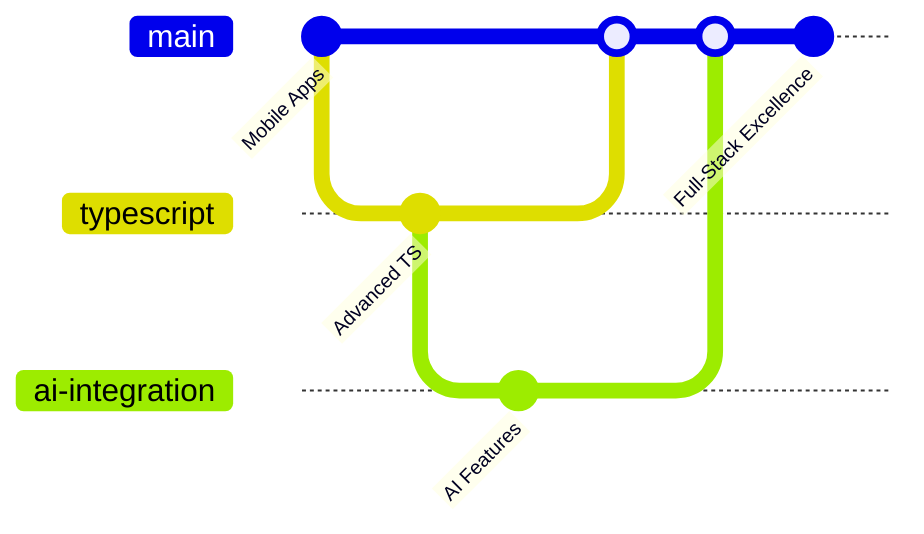

# 🌟 Welcome to the Digital Universe of Bosco Dusengimana

<div align="center">

[](https://git.io/typing-svg)


</div>

---

## 🎯 **Mission Statement**

> *"Transforming ideas into digital experiences that transcend time and technology boundaries. Every pixel matters, every interaction counts."*

<div align="center">


[](https://github.com/bosco250)
[](https://github.com/bosco250)

</div>

---

## 🏆 **Achievement Constellation**

<div align="center">

</div>

---

## 🚀 **Current Trajectory**

<table>
<tr>
<td width="50%">

### 🌱 **Learning Frontier**
```javascript
const currentFocus = {
  mobile: "React Native 📱",
  language: "TypeScript 🔷",
  mastery: "Advanced JavaScript ⚡",
  architecture: "System Design 🏗️",
  future: "Web3 & AI Integration 🤖"
};
```

</td>
<td width="50%">

### 📡 **Communication Channels**
```yaml
primary_contact:
  email: "dusengimana06@gmail.com"
  location: "Kigali, Rwanda 🇷🇼"
  timezone: "CAT (UTC+2)"
  availability: "Open for collaborations"
```

</td>
</tr>
</table>

---

## 🛠️ **Technology Arsenal**

<div align="center">

### **Frontend Mastery**
<p>

</p>

### **Backend & Database**
<p>

</p>

### **Tools & Platforms**
<p>

</p>

</div>

---

## 📊 **Performance Analytics**

<div align="center">
<table>
<tr>
<td width="50%">

</td>
<td width="50%">

</td>
</tr>
</table>


</div>

---

## 🎨 **Code Philosophy**

<div align="center">

```ascii
    ╭─────────────────────────────────────────────────╮
    │  "Clean code is not written by following a      │
    │   set of rules. You don't become a software     │
    │   craftsman by learning a list of heuristics.   │
    │   Professionalism and craftsmanship come from   │
    │   values that drive disciplines."                │
    │                                                  │
    │                        - Robert C. Martin       │
    ╰─────────────────────────────────────────────────╯
```

</div>

---

## 🌐 **Recent Contributions**

<div align="center">

</div>

---

## 💡 **Innovation Metrics**

<div align="center">

| Metric | Value | Progress |
|--------|--------|----------|
| **Code Quality** | 95% | ████████████████████ |
| **Problem Solving** | 90% | ██████████████████░░ |
| **Team Collaboration** | 88% | █████████████████░░░ |
| **Innovation Index** | 92% | ██████████████████░░ |
| **Learning Velocity** | 85% | █████████████████░░░ |

</div>

---

## 🎯 **2024+ Roadmap**



---

<div align="center">

### 🌟 **"The future belongs to those who code it"**


---

⭐ **If this profile inspired you, consider giving my repositories a star!** ⭐

[](https://github.com/bosco250)

</div>

---

<div align="right">

*Last updated: 2025 • Built to impress until 2050 and beyond! 🚀*

</div>
